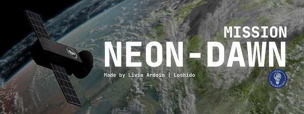
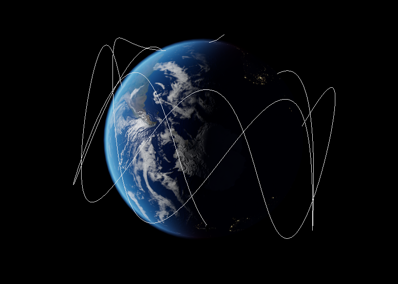
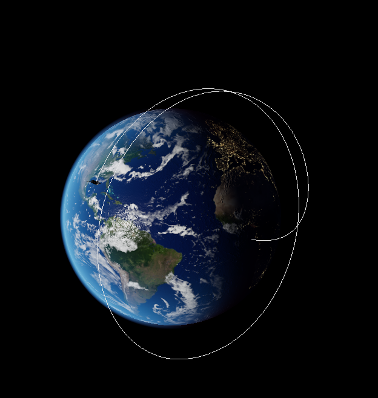

*This article is written by Livio Ardoin (Loshido) in August 2025*

# Neon-dawn 
[

](https://github.com/Loshido/neon-dawn)

Neon-dawn is an hackaton that can be organized by anyone with enough web knowledge.


To put it simply, the host shows a web page with the earth and the participant gets a paper with instructions to launch a satellite onto that web page.

## To be figured out

- How HTTP work, how request are convoyed.
- The concept of endpoints
- The concept of HTTP method
- CORS 😍(😭)
- The WebSocket protocole
- The orbit of a satellite around the earth
- cos, sin functions

---

## Setup (for the host)

Prerequisites
- Being in a private network, ex: everyone has an address under 10.66.66.0/24
- [Deno](https://deno.com) installed
- [Neon-dawn Repository](https://github.com/Loshido/neon-dawn) installed
- Make sure you received `public/model/satellite.glb` & `public/textures/8k...` from the git repository.

Commands
 - `deno task web` - bundle the web page into `/dist`
 - `deno task dev` - start the host server on port 80
 - `deno task client` - start a webserver example (a satellite with weird orbit)

Keyboard inputs
 - `Space` - Stop the camera rotation
 - `ArrowUp` - Increment the rotation speed
 - `ArrowDown` - Decrement the rotation speed
 - `l` - Toggle the orbit controls (click on satellite -> orbit around it if orbit controls is enable)
 - `o` - Toggle satellite list


There are 2 **mode** for the app, 'remote' or 'local', 'remote' by default
 - remote, wait for participant's webapp to register to display a satellite
 - local, wait for the host to register a satellite

> You can change the **mode** in the first line of `src-web/main.ts`.
> Then you'll need to bundle the app again `deno task web`

### CORS - **Warning ⚠️**

<abbr title="Cross-Origin Resource Sharing">CORS</abbr> is likely to confuse many newcomers,
they may need to add a header that looks like those, in order to the host to properly request the participant's web server.

```.env
# port 80, 10.66.66.4 being the host ip address in the private network
Access-Control-Allow-Origin=http://10.66.66.4 
Access-Control-Allow-Origin=http://10.66.66.4:81 
Access-Control-Allow-Origin=http://192.168.1.62:8000
```

---

## Instructions

Here are the instruction for participants

 - [English instruction](/content/neon-dawn/instructions-en.pdf)
 - [French instruction](/content/neon-dawn/instructions-fr.pdf)


## Contributions

If you encounter any issue, [create an issue on github](https://github.com/Loshido/neon-dawn/issues/new/choose) so I get notified and I can fix it. 


I'm open to contributions or forks too 🤗.

## Gallery


| Weird Orbit | Test Orbit |
| --- | --- |
|  |  |

#### Early stage demo 
<iframe width="600" height="300" src="https://www.youtube-nocookie.com/embed/hstvH9vlXqU?si=yORvLGJMr4Kog65G&amp;controls=0" title="Neon-dawn test" frameborder="0" allow="accelerometer; autoplay; clipboard-write; encrypted-media; gyroscope; picture-in-picture; web-share" referrerpolicy="strict-origin-when-cross-origin" allowfullscreen></iframe>

#### Having fun debugging
<iframe width="600" height="300" src="https://www.youtube-nocookie.com/embed/Vl2YJ6cfW50?si=RKgMHF7a_272qAbc&amp;controls=0" title="Neon-dawn test" frameborder="0" allow="accelerometer; autoplay; clipboard-write; encrypted-media; gyroscope; picture-in-picture; web-share" referrerpolicy="strict-origin-when-cross-origin" allowfullscreen></iframe>