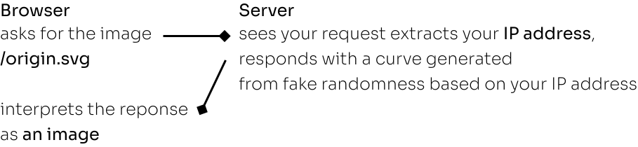
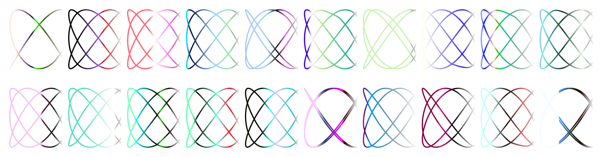
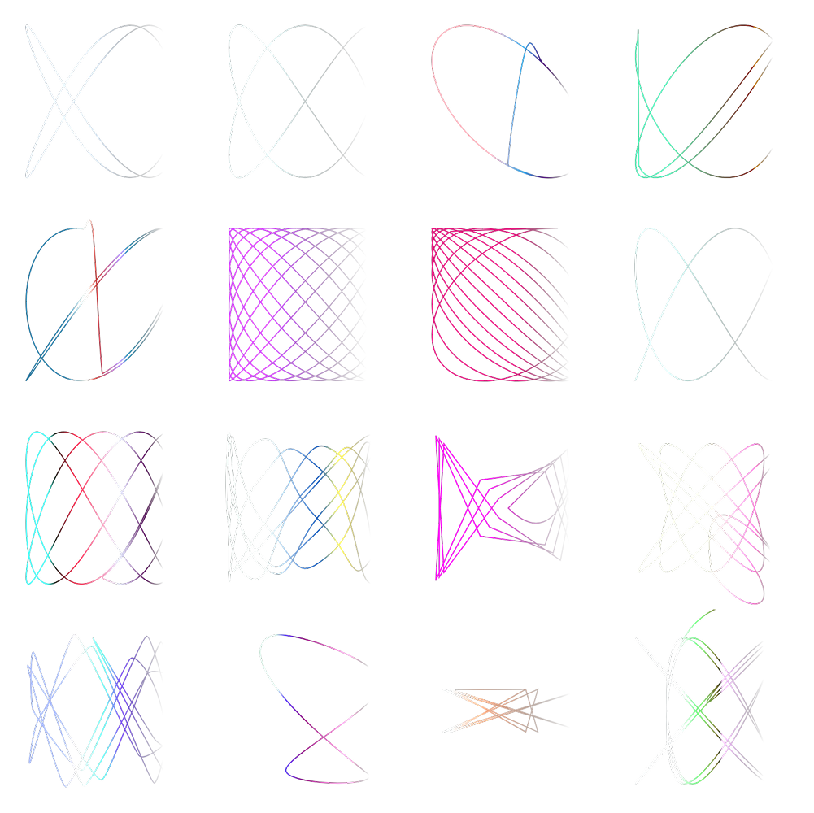

You are the only one seeing this image\
(It is generated for you)

In fact, this image is generated based on the IP address you use to surf the web.\

> 

### Steps

- We watch for request at some path (e.g.: `/origin.svg`)
- extract the ip address
- hash it to get a number called seed, the goal is that 10.66.66.1's seed\
needs to be significantly different from that of 10.66.66.2. This will bring us closer to randomness.
- we can now use a pseudorandom number generator\
to generate a few parameters
- generate a vector Lissajous curve in svg

### In production

Since we compute only 50 points in the vector image,
handling a request is not that expensive (less than 1ms per image).

At some point in the process I thought I would have to put a cache layer (<abbr title="Least Recently Used">LRU</abbr>),\
but after a few optimizations, it became very fast.

In addition, the image is generated once and won't mutate for you,\
so we can use client-side cache in order to reduce the impact on the server. 

### Collection

Pregenerated with random parameters
> 

Pregenerated with unstable / unoptimized parameters
> 